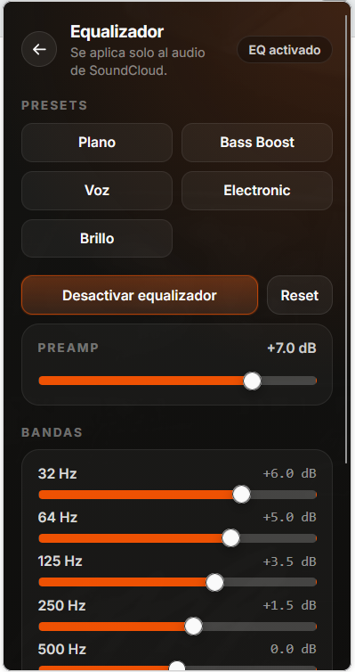
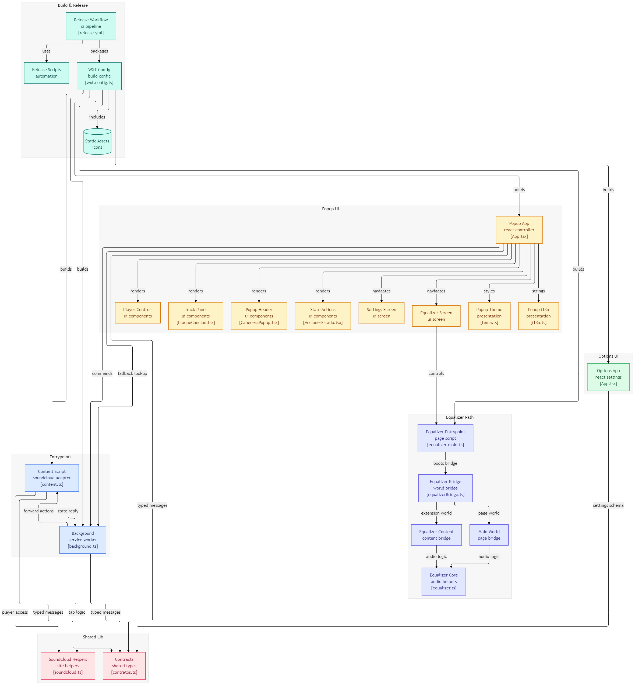

# SoundCloud Control

<p align="start">
  <a href="">
    
  </a>
  
  <a href="https://addons.mozilla.org/es-ES/firefox/addon/soundcloud-control/">
    
  </a>
</p>


### Controla SoundCloud sin cambiar de pestaña


## Qué es

SoundCloud Control es una extensión para navegador que te deja manejar SoundCloud desde un popup rápido:

- Controles principales: anterior, play/pause, siguiente.
- Controles avanzados: shuffle, repetir lista, repetir pista, me gusta, mute.
- Equalizador integrado.
- Modo compacto para una UI más horizontal.
- Botón de descarga MP3 configurable.
- Aviso de actualización automática cuando hay nueva versión en GitHub Releases.

Está pensada para ir rápido: abres el popup, tocas un botón y listo.

## Capturas

| Firefox | Chrome |
|:--:|:--:|
|  |  |

| Compact mode | Tema personalizado + Equalizador |
|:--:|:--:|
|  |  |

| Equalizador |
|:--:|
|  |

## Arquitectura

Diagrama generado desde GitDiagram:

- https://gitdiagram.com/cristiancastineiras/SoundCloudControl



## Stack

- WXT
- React + TypeScript
- Tailwind CSS v4
- Phosphor Icons

## Estructura rápida

- entrypoints/background.ts: coordinación de pestañas, comandos y mensajería.
- entrypoints/content.ts: control real del reproductor de SoundCloud en página.
- entrypoints/popup/App.tsx: lógica principal del popup.
- entrypoints/options/App.tsx: página de ajustes dedicada.
- entrypoints/popup/componentes: UI reutilizable.
- lib/contratos.ts: tipos y contratos compartidos.
- wxt.config.ts: manifest, permisos y build.

## Requisitos

- Node.js 20+ (recomendado)
- pnpm

## Instalación

```bash
pnpm install
```

## Comandos útiles

```bash
# Desarrollo
pnpm dev

# Desarrollo Firefox
pnpm dev:firefox

# Type-check
pnpm compile

# Build
pnpm build
pnpm build:firefox

# Zips para releases
pnpm zip
pnpm zip:firefox
pnpm zip:all
```

## Uso en 20 segundos

1. Abre SoundCloud en al menos una pestaña.
2. Pulsa el icono de la extensión.
3. Controla música sin cambiar de pestaña.

Si no hay pestaña compatible, el popup te muestra el estado y la opción de abrir SoundCloud.

## Atajos de teclado

Definidos en wxt.config.ts:

- Ctrl+Shift+5: pista anterior
- Ctrl+Shift+6: play/pause
- Ctrl+Shift+7: pista siguiente

Puedes cambiarlos desde la gestión de atajos del navegador.

## Permisos

- tabs: localizar y activar pestañas de SoundCloud.
- host_permissions en soundcloud.com y subdominios.
- host_permissions en api.github.com para comprobar nuevas releases.

## Release flow

- El workflow de release se dispara al hacer push de un tag tipo vX.Y.Z.
- Se ejecuta type-check, se generan zips para Chrome/Firefox y se publica release automática.

## Estado

Proyecto activo y orientado a velocidad de uso, con una UI compacta y configurable para el día a día.
